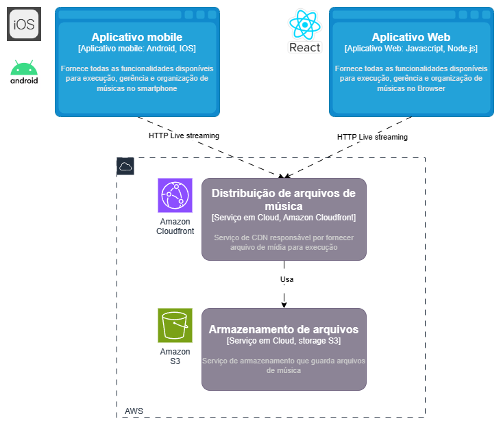

# SpotMusic iOS App

O `spotmusic-ios-app` é o aplicativo da SpotMusic para dispositivos iOS, oferecendo uma experiência de usuário envolvente e personalizada para o streaming de músicas e gerenciamento de playlists. Este aplicativo é uma peça chave para posicionar a SpotMusic como uma marca forte no mercado altamente competitivo de aplicativos de música.

## Pilha Tecnológica
- **Linguagem de Programação:** Swift
- **Gerenciamento de Estado:** Arquitetura MVVM com Combine e SwiftUI

## Arquitetura do Serviço de Reprodução de Músicas



## Configuração e Instalação
Para configurar e executar o `spotmusic-ios-app` em seu ambiente de desenvolvimento, siga os passos abaixo:

```bash
# Clone o repositório
git clone https://github.com/fiap-spotmusic/spotmusic-ios-app.git
cd spotmusic-ios-app

# Abra o projeto no Xcode
# O Xcode deve resolver automaticamente as dependências do Swift Package Manager

# Configure as variáveis de ambiente e chaves de API no arquivo `Info.plist`

# Execute o aplicativo em um simulador ou dispositivo conectado através do Xcode
```